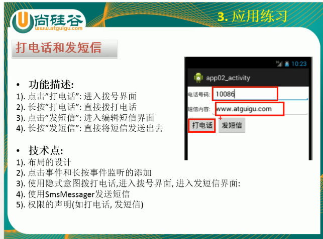
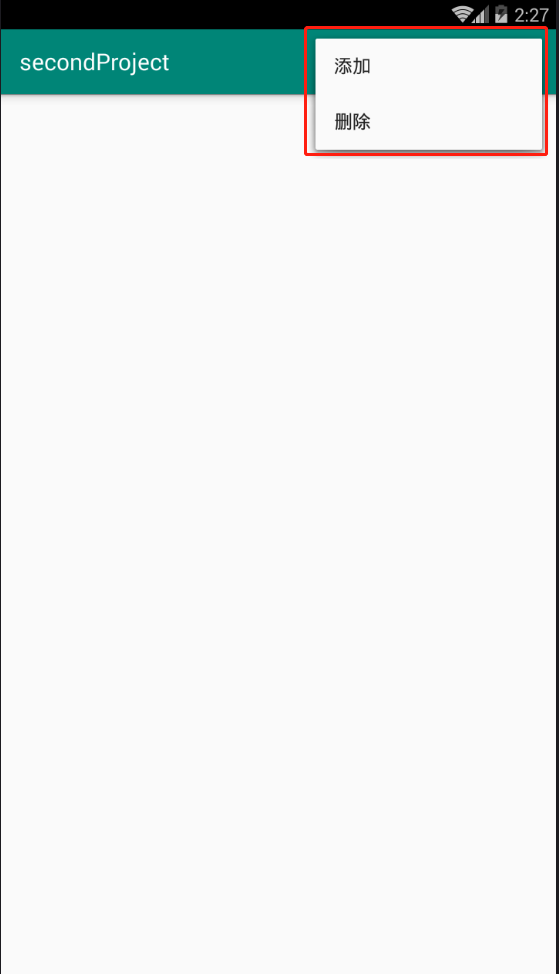
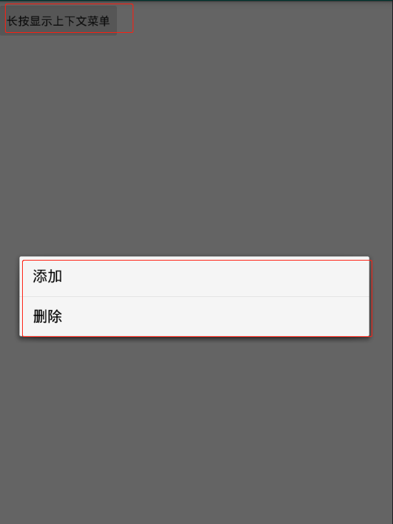
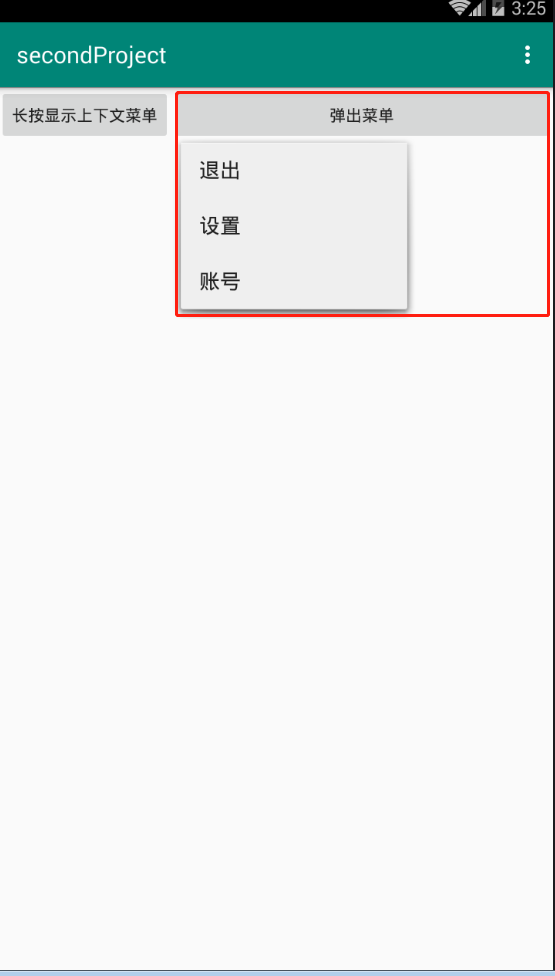
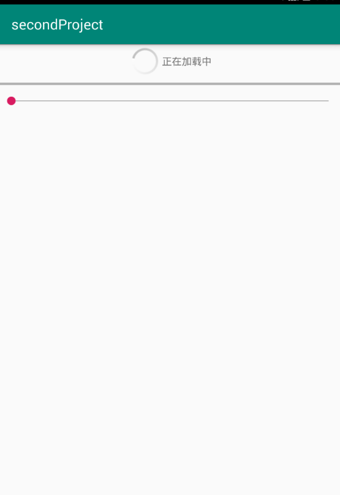
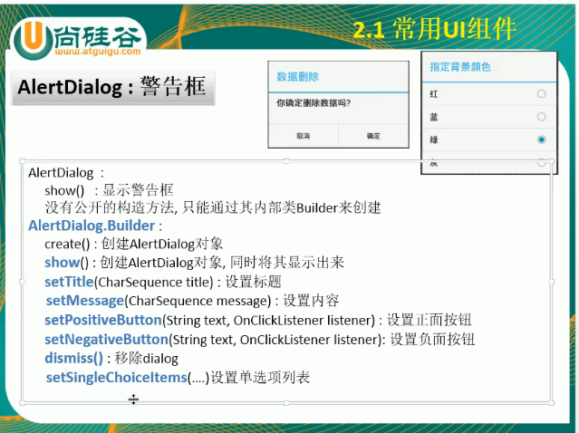
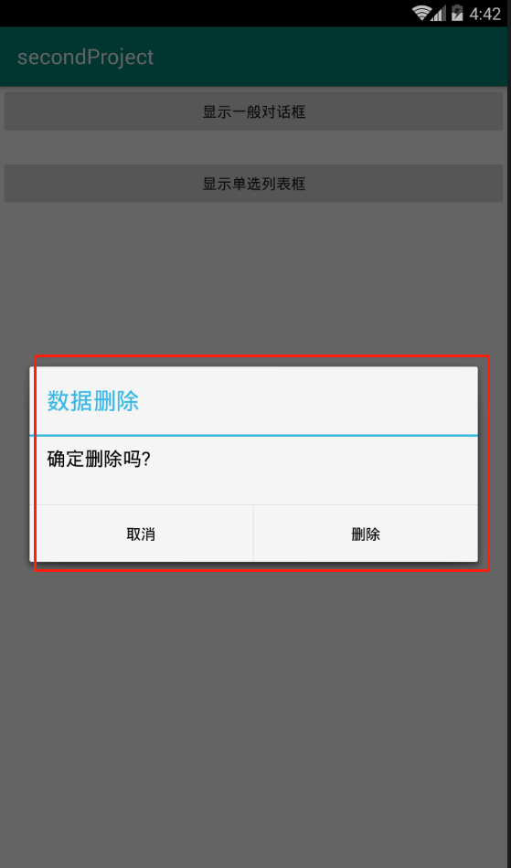
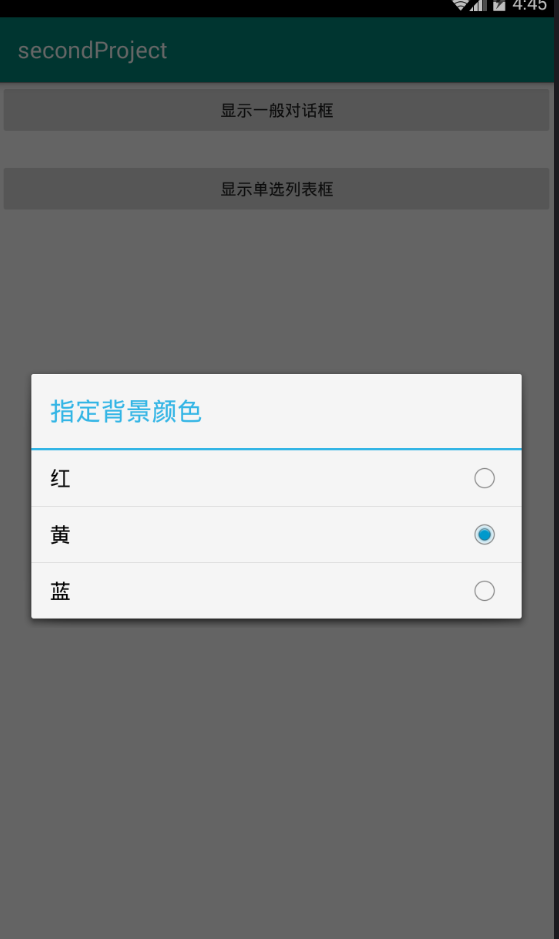
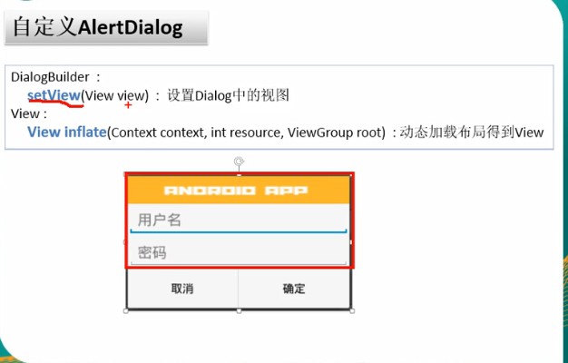

# 打电话和发短信

## 功能描述
- 


## 细节
- match_parent： 会适应父容器，将父容器的页面全部覆盖,一旦是线性水平均布局的话，那么这个控件将会独占一行

- wrap_content ： 是适应控件的大小 


## 界面布局
- 最外层是一个垂直的线性布局
- 里面的每一行是一个水平的线性布局


## 显式意图和隐式意图的区别
- 显式意图是跳转到本项目中的activity，隐式意图是跳转到本项目之外的activity，比如拨号界面，发短信页面
- 显示意图需要指定activity的class


## OptionMenu(选项菜单)
- 点击menu按钮，显示选项菜单，效果如下：
- 

### 创建菜单选项

- activity需要重写`onCreateOptionsMenu`方法，在其中添加选项菜单即可，如下：

```java
/**
     * 点击菜单按钮显示选项菜单
     * @param menu
     * @return
     */
    @Override
    public boolean onCreateOptionsMenu(Menu menu) {
        /**
         * 第一个参数是分组，如果没有分组，一般是NONE即是0
         * 第二个参数是ItemId，唯一标识，每个选项必须是不同的
         * 第三个参数是显示的顺序，越小的显示在上面
         * 第四个参数是显示的内容
         */
        menu.add(Menu.NONE, 1, 1, "添加");
        menu.add(Menu.NONE, 2, 2, "删除");
        return super.onCreateOptionsMenu(menu);
    }
```
### 监听选中的状态

- 选中监听，实现`onOptionsItemSelected`这个方法即可即可，其中使用ItemId判断选中了那个item，如下：
```java
/**
     * 选项菜单被选中的监听
     * @param item
     * @return
     */
    @Override
    public boolean onOptionsItemSelected(MenuItem item) {
        switch (item.getItemId()) {  //使用itemId判断到底选中了按钮
            case 1:
                Toast.makeText(this, "选择了添加", Toast.LENGTH_SHORT).show();
                break;
            case 2:
                Toast.makeText(this, "选择了删除", Toast.LENGTH_SHORT).show();
                break;
        }
        return super.onOptionsItemSelected(item);
    }
```


## ContextMenu（上下文菜单）
- 长按按钮，显示上下文菜单，显示的效果如下：
- 

### 创建选项
- 需要有一个按钮，并且为这个按钮设置一个监听的方法`setOnCreateContextMenuListener(OnCreateContextMenuListener l)`,这个方法需要在activity重写即可，重写的方法如下：
```java
    /**
         * 创建上下文菜单，通过长按视图触发，因此需要在view设置监听
         * @param menu
         * @param v
         * @param menuInfo
         */
        @Override
        public void onCreateContextMenu(ContextMenu menu, View v, ContextMenu.ContextMenuInfo menuInfo) {
            super.onCreateContextMenu(menu, v, menuInfo);
            menu.add(Menu.NONE,1,1,"添加");  //添加一个上下文选项
            MenuItem item = menu.add(Menu.NONE, 2, 2, "删除");
        }
```

### 监听选中的状态
- 在activity中重写`onContextItemSelected`这个方法监听，如下：
```java
    /**
         * 上下文菜单的选中监听
         * @param item
         * @return
         */
        @Override
        public boolean onContextItemSelected(MenuItem item) {
            switch (item.getItemId()){
                case 1:
                    Toast.makeText(this, "选择了添加", Toast.LENGTH_SHORT).show();
                    break;
                case 2:
                    Toast.makeText(this, "选择了删除", Toast.LENGTH_SHORT).show();
                    break;
            }
            return super.onContextItemSelected(item);
        }
```


## 弹出式菜单
- 弹出式菜单的样式如下：


### 创建选项
- 在res的包下新建一个menu文件夹，在其中新建一个second.xml（文件名称任意），其中的内容如下：
```xml
<?xml version="1.0" encoding="utf-8"?>
<menu xmlns:android="http://schemas.android.com/apk/res/android">
    <item android:id="@+id/exit"
        android:title="退出"/>
    <item android:id="@+id/set"
        android:title="设置"/>
    <item android:id="@+id/account"
        android:title="账号"/>
</menu>
```


### 新建菜单
- 在当前的activity中新建一个按钮监听
```java
//点击按钮显示弹出式菜单
        btn_5.setOnClickListener(new View.OnClickListener() {
            @Override
            public void onClick(View v) {
                /**
                 * 新建一个弹出式菜单
                 * 第一个参数是当前的activity
                 * 第二个参数是当前触发的view
                 */
                PopupMenu menu=new PopupMenu(SecondActivity.this,btn_5);

                //加载选项，这里定义文件在//res/second.xml中
                menu.getMenuInflater().inflate(R.menu.second,menu.getMenu());

                //创建监听选中的事件，只要选项被选中了就能监听到
                menu.setOnMenuItemClickListener(new PopupMenu.OnMenuItemClickListener() {

                    @Override
                    public boolean onMenuItemClick(MenuItem item) {
                        switch (item.getItemId()){
                            case R.id.exit:
                                Toast.makeText(SecondActivity.this,"退出",Toast.LENGTH_SHORT).show();
                                break;
                            case R.id.account:
                                Toast.makeText(SecondActivity.this,"账号",Toast.LENGTH_SHORT).show();
                                break;
                            case R.id.set:
                                Toast.makeText(SecondActivity.this,"设置",Toast.LENGTH_SHORT).show();
                                break;
                        }
                        return true;
                    }
                });
                menu.show();  //显示弹出菜单
            }
        });
```


## 进度条
- 效果如下：
- 


```java
protected void onCreate(Bundle savedInstanceState) {
        super.onCreate(savedInstanceState);
        setContentView(R.layout.activity_third);

        ll_progress=findViewById(R.id.ll_progress);
        bar_1=findViewById(R.id.bar_1);
        seekBar=findViewById(R.id.seekBar);

        //给seekBar设置监听
        seekBar.setOnSeekBarChangeListener(new SeekBar.OnSeekBarChangeListener() {

            //进度改变的时候调用
            @Override
            public void onProgressChanged(SeekBar seekBar, int progress, boolean fromUser) {

            }

            //开始滑竿的时候调用
            @Override
            public void onStartTrackingTouch(SeekBar seekBar) {

            }

            //离开滑竿的时候调用
            @Override
            public void onStopTrackingTouch(SeekBar seekBar) {
                int progress = seekBar.getProgress();  //seekbar的进度
                bar_1.setProgress(progress); //设置进度

                if (progress==seekBar.getMax()){  //判断是否达到最大值

                    /**
                     * View.INVISIBLE：不可见，但是占用空间
                     *  View.GONE：不可见，且不占用空间
                     */
                    ll_progress.setVisibility(View.GONE);  //设置不可见
                }else{  //如果没有达到最大值
                    ll_progress.setVisibility(View.VISIBLE);  //设置可见
                }
            }
        });
    }
```


## 对话框

- 常用API



### 显示一般的对话框
- 效果如下：


```java
/**
     * 显示一般的对话框
     * @param v
     */
    public void showAD(View v){
        new AlertDialog.Builder(this)
                .setTitle("数据删除")  //设置标题
                .setMessage("确定删除吗?")   //设置提示信息
                .setPositiveButton("删除", new DialogInterface.OnClickListener() {  //设置正向的选项
                    @Override
                    public void onClick(DialogInterface dialog, int which) {
                        System.out.println("点击了删除");
                    }
                })
                .setNegativeButton("取消", new DialogInterface.OnClickListener() {  //设置反向的选项
                    @Override
                    public void onClick(DialogInterface dialog, int which) {
                        System.out.println("点击了取消");
                    }
                })
                .show();

    }
```


### 显示单选对话框
- 效果如下：


```java
  /**
     * 显示单选对话框
     * @param v
     */
    public void showSignal(View v){
        final String[] color={"红","黄","蓝"};  //需要定义为final类型的选项
        new AlertDialog.Builder(this)
                .setTitle("指定背景颜色")  //设置标题
                /**
                 * 设置选项和监听
                 * 第一个参数是选项，一个String类型的数组
                 * 第二参数是默认选中的第几个，即是数组的下标
                 * 第三个参数是监听选中的方法
                 *
                 */
                .setSingleChoiceItems(color, 1, new DialogInterface.OnClickListener() {
                    /**
                     * 监听选中的方法
                     * @param dialog  对象
                     * @param which  选中的那个元素的在数组中的下标
                     */
                    @Override
                    public void onClick(DialogInterface dialog, int which) {
                        //提示显示的颜色
                        Toast.makeText(DialogActivity.this,color[which],Toast.LENGTH_SHORT).show();
                        //移除
                        dialog.dismiss();
                    }
                })
                .show();  //显示
    }

```


### 自定义布局的对话框
- 常用的API如下


- 原理: 上面的部分使用的是一个自定义的view（dialog_view.xml），通过动态加载，将其设置在对话框中
- 需要注解是：
    - **获取动态加载的view中的元素的时候不能直接使用`findViewById`,这个是获取当前activity中的控件，可以直接使用动态加载的View对象获取**
- 代码如下：
    - 使用就是`setView(View v)`的方法
```java
/**
     * 显示自定义布局的对话框
     * @param v
     */
    public void showCustom(View v){
        /**
         * 创建一个View
         * 第一个参数指定当前的activity
         * 第二个参数指定View的xml文件
         * 第三个参数指定的是插入到当前activity的xml文件中的节点id，不插入直接传入null即可
         */
        View view=View.inflate(this,R.layout.dialog_view,null);  //动态加载view，这个view自定义的，没有对应的activity

        /**
         * 1、单独执行findViewById这个方法是在当前activity中对应的xml中寻找节点
         * 2、这里我们需要寻找动态加载的view中的节点，那么我们需要调用对应的view的findViewById的方法，如下
         */
        final  EditText userNameText=view.findViewById(R.id.userName);
        final  EditText pwdText=view.findViewById(R.id.pwd);
        new AlertDialog.Builder(this)
                .setTitle("指定背景颜色")  //设置标题
                .setView(view)            //设置其中的View，比如是ImageView
                .setNegativeButton("取消",null)  //反向的选择，不用监听，传入null即可
                .setPositiveButton("登录", new DialogInterface.OnClickListener() {   //登录的选项，正向的选择，需要监听读取数据判断登录
                    @Override
                    public void onClick(DialogInterface dialog, int which) {
                        //读取用户名和密码
                        String userName=userNameText.getText().toString();  //用户名
                        String pwd=pwdText.getText().toString();       //密码
                        if (!userName.equals("admin")||!pwd.equals("123456")){
                            Toast.makeText(DialogActivity.this,"用户名或者密码不正确",Toast.LENGTH_SHORT).show();
                        }else{
//                            dialog.dismiss();  //移除
                            Toast.makeText(DialogActivity.this,"登录成功",Toast.LENGTH_SHORT).show();
                        }
                    }
                })
        .show();
    }
```


